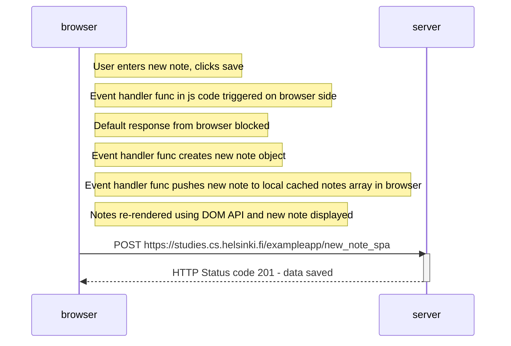

```mermaid
sequenceDiagram
    participant browser
    participant server
    Note right of browser: User enters new note, clicks save
    Note right of browser: Event handler func in js code triggered on browser side
    Note right of browser: Default response from browser blocked
    Note right of browser: Event handler func creates new note object
    Note right of browser: Event handler func pushes new note to local cached notes array in browser
    Note right of browser: Notes re-rendered using DOM API and new note displayed

    browser->>server: POST https://studies.cs.helsinki.fi/exampleapp/new_note_spa 
    activate server
    server-->>browser: HTTP Status code 201 - data saved
    deactivate server

    

```

